# Simple Docker

## Содержание
1. [Part 1. Готовый докер](#part-1-готовый-докер)
2. [Part 2. Операции с контейнером](#part-2-операции-с-контейнером)


## Part 1. Готовый докер

1. Выкачиваем официальный докер-образ nginx командой ```docker pull nginx```<br>
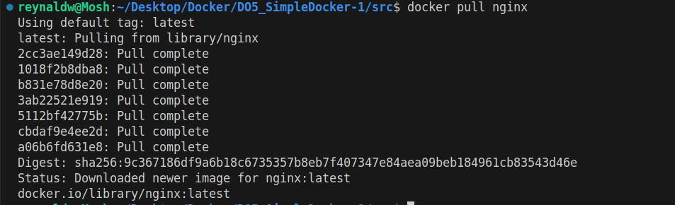

2. Проверяем наличие докер-образа командой ```docker images```<br>
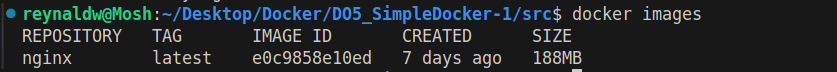

3. Запускаем докер-образ через ```docker run -d [image_id|repository]```<br>


4. Проверяем, что образ запустился через ```docker ps```<br>
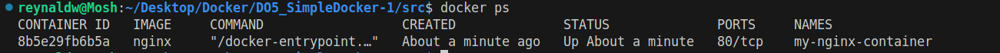

5. Смотрим информацию о контейнере через ```docker inspect my-nginx-container```<br>
Нужно вывести размер контейнера, список замапленных портов и ip контейнера<br>
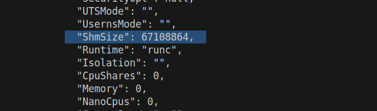

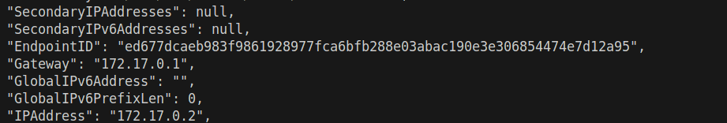

6. Останавливаем докер-образ через ```docker stop [container_id|container_name]```<br>

Проверим, что образ остановился через ```docker ps```:<br>
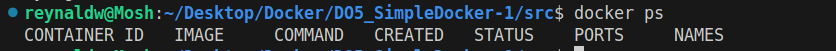

7. Запускаем докер с портами 80 и 443 в контейнере, замапленными на такие же порты на локальной машине, через команду ```docker run -d --name my-nginx-container -p 80:80 -p 443:443 nginx```<br>
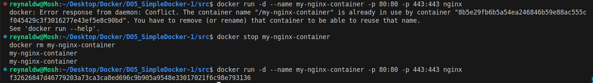

8. Проверим, что в браузере по адресу localhost:80 доступна стартовая страница nginx<br>
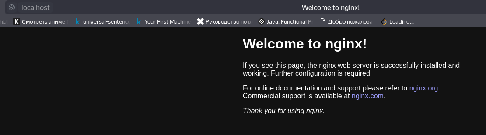

9. Перезапускаем докер контейнер через ```docker restart [container_id|container_name]``` и проверяем, что он перезапустился<br>

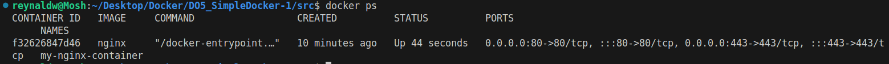

## Part 2. Операции с контейнером

1. Читаем конфигурационный файл nginx.conf внутри докер контейнера через команду exec<br>
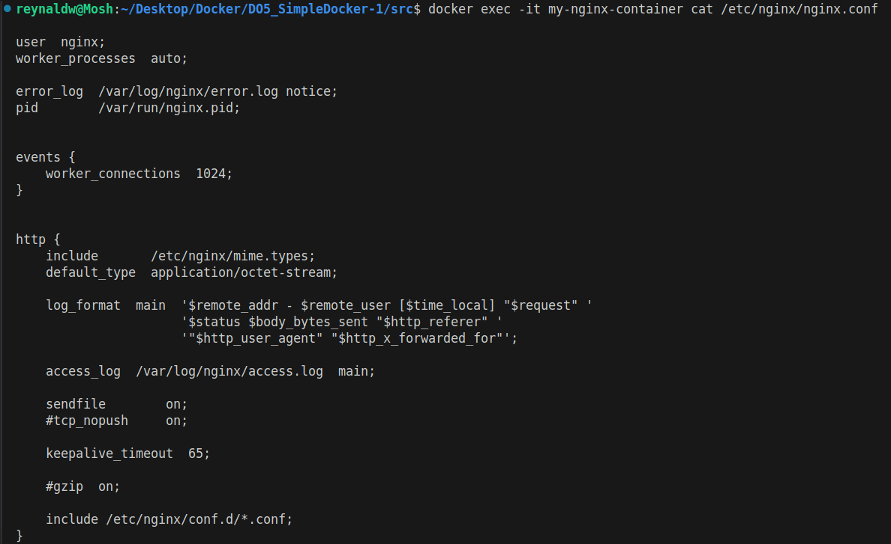

2. Создадим на локальной машине файл nginx.conf через ```nano nginx.conf```
и настраиваем в нем по пути /status отдачу страницы статуса сервера nginx<br>
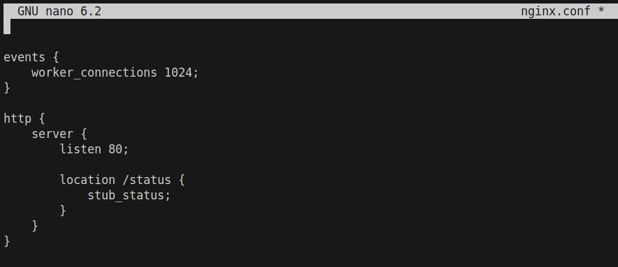

3. Копируем созданный файл nginx.conf внутрь докер образа через команду ```docker cp```<br>
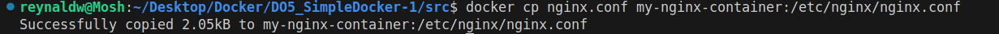

4. Перезапустим nginx внутри докер-образа через команду ```docker exec [container_id|container_name] nginx -s reload```<br>
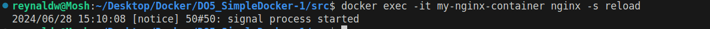

5. Проверяем, что по адресу localhost:80/status отдается страничка со статусом сервера nginx<br>
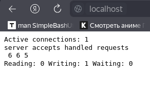

6. Экспортируем контейнер в файл container.tar через команду ```export```
Останавливаем контейнер<br>
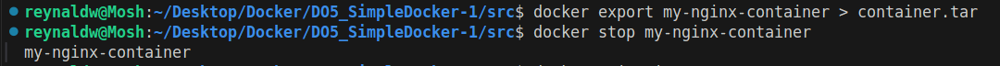

7. Удалим образ через ```docker rmi [image_id|repository]``` лучше ```docker rmi -f nginx```<br>
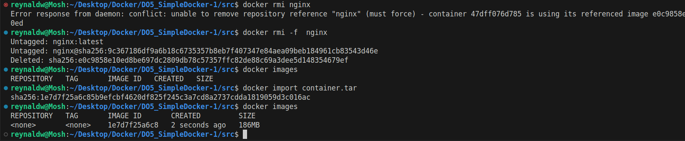

8. Импортируем контейнер обратно через команду ```docker import ```
Инструкция CMD определяет команду, которая будет выполнена при запуске контейнера<br>
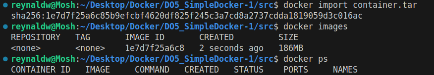<br>

9. Запускаем импортированный контейнер<br>
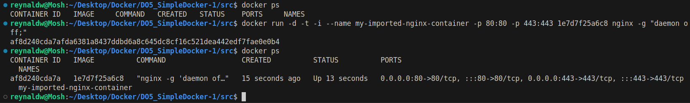

10. Проверяем, что по адресу localhost:80/status отдается страничка со статусом сервера nginx<br>
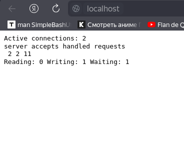<br>